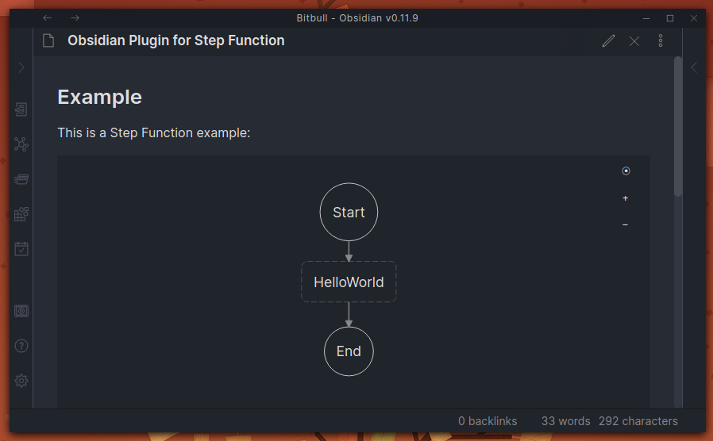

# Obsidian AWS Step Function Plugin

This [Obsidian.md](https://obsidian.md/) plugin will render [Amazon State Language](https://docs.aws.amazon.com/step-functions/latest/dg/concepts-amazon-states-language.html) script into state machine graph.



## Installation

Download zip archive from [GitHub releases page](https://github.com/daaru00/obsidian-aws-sfn/releases) and extract it into `<vault>/.obsidian/plugins` directory.

## Usage

Declare a code black with "asl" type:
````markdown
```asl
{
  "StartAt": "HelloWorld",
  "States": {
    "HelloWorld": {
      "Type": "Pass",
      "Result": "Hello World!",
      "End": true
    }
  }
}
```
````

## Notes

This plugin mimic the [AWS Toolkit for Visual Studio Code](https://github.com/aws/aws-toolkit-vscode) behaviour using the same "GrapheneStateGraph" library.
